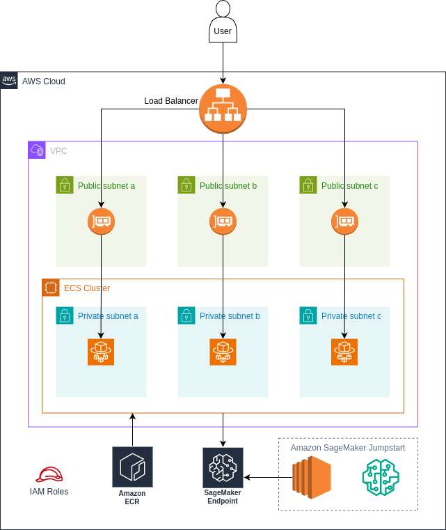

# Question1: Design and deploy a cloud-based ml application

The following sections provide detailed information about the ml application, the utilized model and how to deploy the application on AWS.

### Seeking Alpha news summarization tool
I am very interested in financial topics and stock trading, which is why I am reading a lot of articles on [Seeking Alpha](https://seekingalpha.com/). Being up-to-date with the latest news about relevant companies is very important but also consumes quite a bit of time. Therefore, I have developed a small application that pulls the latest news about any given company from Seeking Alpha and summarizes its news content. The tool allows me to read relevant news in a much shorter time. 

### Chosen Model
For this task, I have chosen the latest [Mistral 7B-instruct-v0.2](https://huggingface.co/mistralai/Mistral-7B-Instruct-v0.2) model. It is open source, outperforms Llama 2 13B across all evaluated benchmarks, has a sufficient context length of 32k tokens and fits on a A10 GPU. Alternative models could have been [Gemma 7B Instruct](https://huggingface.co/google/gemma-7b-it) or maybe even [Gemma 2B Instruct](https://huggingface.co/google/gemma-2b-it).

### Infrastructure
The following diagram showcases the infrastructure of the ml application. 

The frontend application has been dockerized and uploaded to the AWS container registry. From there, the frontend is picked up and deployed using AWS ECS - Fargate which offers a scalable, serverless, pay-as-you-go service for containerized applications. The application can be reached from the outside world via a load balancer. The internal application is performing RestAPI calls against the Seeking Alpha API using an API key. In addition to that it performs inference api calls against a SageMaker endpoint which is made accessible via an IAM role. The SageMaker endpoint is created via Amazon SageMaker Jumpstart. 

### Deployment
The deployment of the application requires 3 steps.
1. Deploy the model via Amazon SageMaker Jumpstart.
For this, just open your Sagemaker Domain, click on JumpStart, select the HuggingFace Provider, select the Mistral 7B-instruct model and click on "Deploy" twice. An alternative approach would be to enter the mistral 7B-instruct-v0.2 model page on HuggingFace and click on "Deploy" in the top right corner of the screen and then select "Amazon SageMaker". You can copy the SDK or jumpstart code into a running instance on SageMaker that has a sufficient hardware spec.   
2. Frontend: Copy the endpoint url from step 1 into `app/src/.env` name the variable `SAGEMAKER_ENDPOINT`. (Also include `SEEKING_ALPHA_API_KEY`, `SEEKING_ALPHA_HOST` and `REGION` here). Then build the docker image by running `docker build -t frontend .` within the app directory. Finally, push the image to the ECR. (Usually, the docker build and push step would be automated via a CICD pipeline, triggering eg. cloud build).
3. 